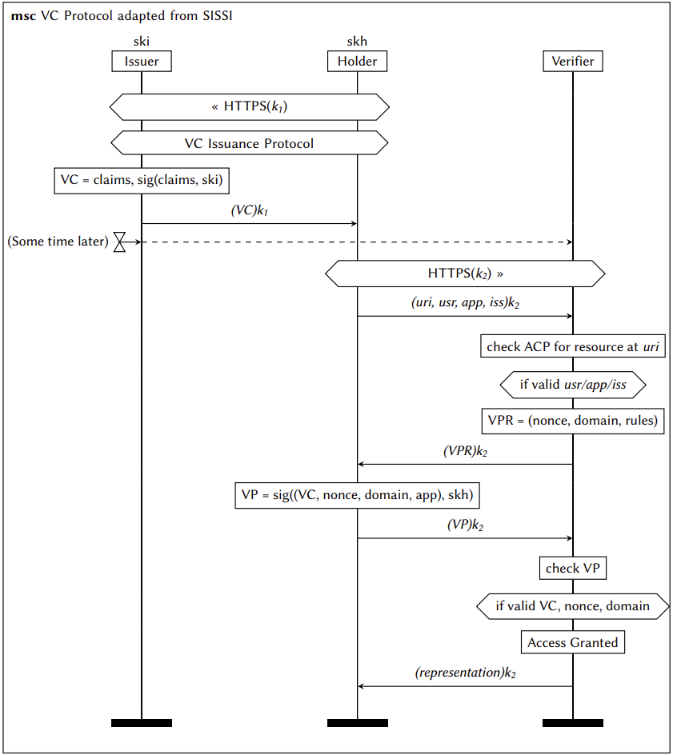
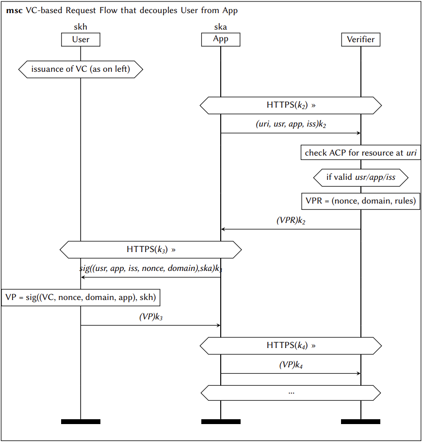
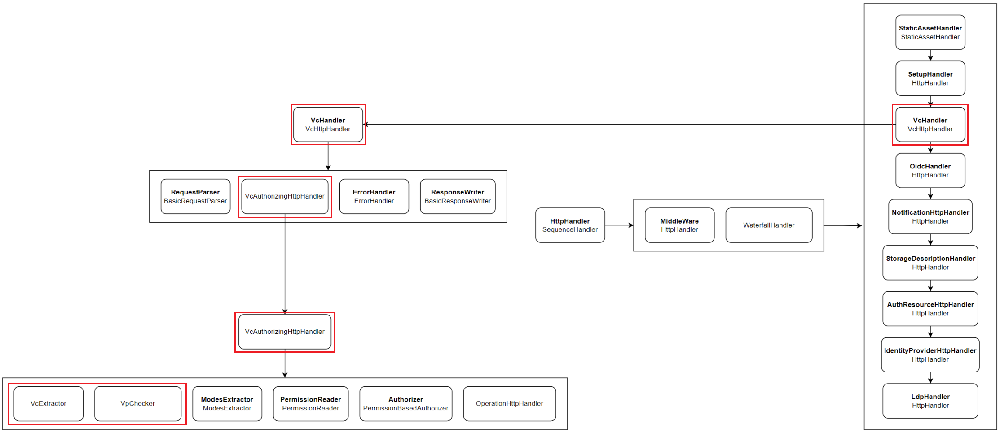
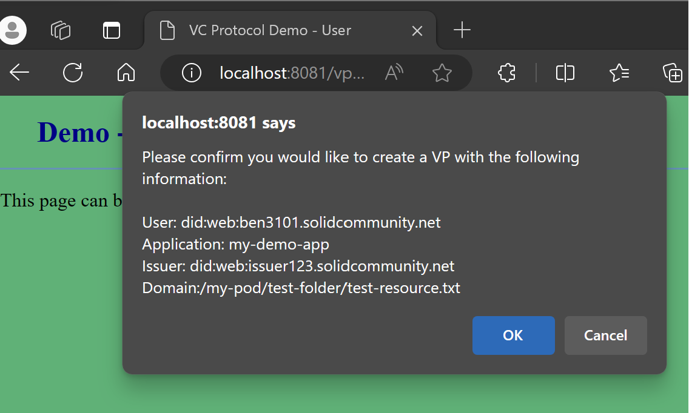
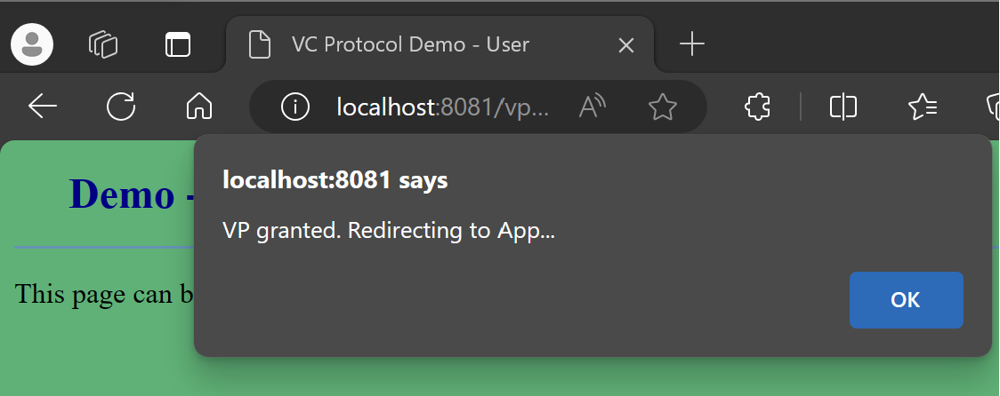

# Community Solid Server


**The Community Solid Server is open software
that provides you with a [Solid](https://solidproject.org/) Pod and identity.
This Pod acts as your own personal storage space
so you can share data with people and Solid applications.**

This version of the Community Solid Server supports a new VC-based authentication protocol as an alternative to Solid-OIDC. An outline of this protocol, the modifications applied to CSS in order to implement it, and a demonstration can be seen in the sections below.

## The VC-Based Protocol

### Protocol adapted from SSI Specifications


### Protocol adapted for Solid, where App and User are decoupled


 Authentication properties of the protocol have been [formally verified](https://github.com/ben3101/CommunitySolidServer/tree/main/FormalVer) with ProVerif. 

## New Component Architecture


 The new protocol is integrated into CSS after creating 4 new components:
 - **VcHttpHandler**: Included among the server's existing HTTP components. Listens for and responds to requests which contain a **vc** header indicating it is the initial request for a resource, or a **vp** header indicating it is the secondary message in the protocol and a VP is present.
 - **VcAuthorizingHttpHandler**: Performs the necessary steps for authorisation. During the initial request, it uses a simple component called VcExtractor to retrieve the user/app/issuer from the body of the HTTP request and returns them as a Credentials object. Using this, it checks that the given user/app/issuer combination is listed in the ACP policies for the requested resource. If so, the VcHttpHandler responds with a Verifiable Presentation Request. In the secondary request, it uses a VpChecker component to verify a VP and determine whether the request can be authorised.
 - **VcExtractor**: Retrieves the user, app and issuer from the body of an HTTP request.
 - **VpChecker**: Verifies a VP and VC using libraries from the [Decentralised Identity Foundation](https://github.com/decentralized-identity).

 Additionally, existing config files are changed to modify the server's authorisation components to use ACP instead of WAC:
 - **webacl.json** is replaced with **acp.json**
 - **acl.json** is replaced with **acr.json**

 The [**file-vc.json**](config/file-vc.json) file is used to run this new version of the server.

## Running the Modified Community Solid Server

Use [Node.js](https://nodejs.org/en/) 14.14 or up and execute:

```shell
npm ci
```
to install dependencies, and then start the server with:

```shell
npm start -- -c config/file-vc.json -f .data
```

or by using the shortcut:

```shell
npm run vc-protocol-server
```

And the server will start running on [http://localhost:3000/](http://localhost:3000/)

## Demo Applications

Two demo applications have been configured to interact with this version of the server and follow the VC-based protocol that has been adapted for Solid, with a separate App and User.
- **App** - [my-demo-app](https://github.com/ben3101/my-demo-app)
- **User** - [my-demo-app-user](https://github.com/ben3101/my-demo-app-user)

After cloning each application, cd to them and install each of their depencencies with:
```shell
npm ci
```

The App can be started by executing the following command:
```shell
npm run start
```

And the User with
```shell
node user.js
```

The App and User will be running on [http://localhost:8080/](http://localhost:8080/) and [http://localhost:8081/](http://localhost:8081/) respectively.

## Demonstration

For demonstration purposes, this server has a pod set up with a test resource and access control rules. Inside the '.data' directory, there is a pod called 'my-pod'. Contained within this is a folder with a resource, 'test-resource.txt' and its corresponding access control resource (acr) file. 


With the server and both demo applications running, the process can be initiated by visiting the App on [http://localhost:8080/](http://localhost:8080/) and clicking the GET button. This will send a request to the displayed URL - targeting the test resource on the CSS server. 

As the App does not currently have a VP, this will be an initial request - a POST request containing a body that indicates a user, app and vc issuer, along with a 'vc' header.

The CSS server receives this request and the credentials asserted in the body are compared with the acr file for the resource. Since they match, a VP Request is generated and sent in response.


 This is displayed in the App's interface and a request is sent to the User in order to acquire a VP.


 

In response, the User checks the information provided to ensure that the App is recognised, and that an appropriate VP can be generated. If so, it redirects to an HTML page where it can be explicitly confirmed that the user wishes to send the App a VP.



 

If confirmed, it redirects back to the App. The VP is contained within the URL parameters, encoded as a JWT.

 

 Clicking the GET button this time will send a secondary request for the resource - a GET request containing the VP JWT inside a 'vp' header.

 The server will first ensure the nonce and domain are valid, before verifying the VP and VC. If they are verified, a Credentials object is created with the user, issuer and app.


 The credentials extracted from the VP are then compared again with the resource's acr file. Since they match, the request is authorised and the response is sent to the App.


